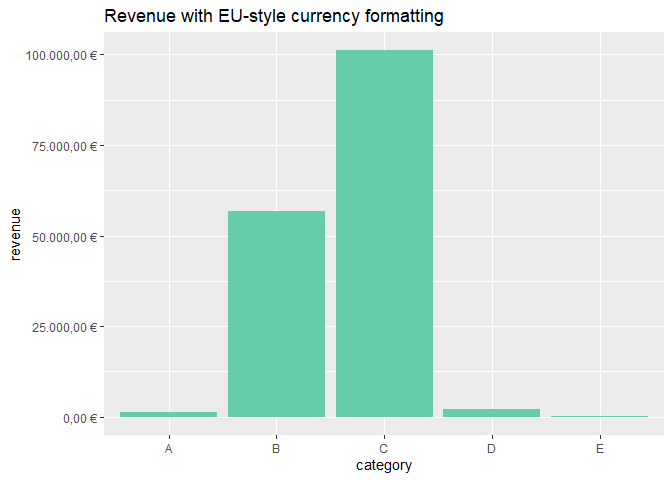

# euformat

The euformat package provides a lightweight way to:

- store numbers as real numeric values,  
- but print them using European number formatting:
  - comma for decimals  
  - dot for thousands  
  - optional euro currency symbol (” €“)

Formatted numbers behave exactly like numeric\* in calculations; only
printing changes.

The package works consistently in:

- R console  
- base data.frames  
- tibbles  
- DT tables

and includes a global toggle to enable/disable printing.

<!-- badges: start -->

<!-- badges: end -->

## Installation

You can install the development version of euformat from
[GitHub](https://github.com/) with:

``` r
# install.packages("pak")
pak::pak("icg-cat/euformat")
```

``` r
library(ggplot2)
#> Warning: package 'ggplot2' was built under R version 4.4.3
library(tibble)
#> Warning: package 'tibble' was built under R version 4.4.3
library(DT)
#> Warning: package 'DT' was built under R version 4.4.3
library(euformat)
```

## Basic usage

### Create EU-formatted numbers

``` r
x <- eu_num(c(1234.567, 10.2))
x
#> [1] "1.234,57" "10,20"
```

Internally still numeric:

``` r
is.numeric(x)
#> [1] TRUE
x + 1
#> [1] "1.235,57" "11,20"
```

## Currency formatting

``` r
eu_currency(c(1500, 20000))
#> [1] "1.500,00 €"  "20.000,00 €"
```

## Vectorized decimal digits

``` r
eu_num(c(1.2345, 2.34567), digits = c(1, 3))
#> [1] "1,2"   "2,346" "1,2"   "2,346"
```

## Using euformat inside tibbles

``` r
tibble(value = eu_num(c(1234.5, 98765.432)))
#> # A tibble: 2 × 1
#>       value
#>    <eu_num>
#> 1  1.234,50
#> 2 98.765,43
```

## Using euformat in base data frames

``` r
data.frame(amount = eu_currency(c(1234.5, 98765.4)))
#>        amount
#> 1  1.234,50 €
#> 2 98.765,40 €
```

## Formatting in DT tables

``` r
df <- cbind(
  item  = c("A", "B", "C", "D"),
  value = c(2, 10, 1000.5, 12.34), 
  cost  = (c(2, 10, 1000.5, 12.34) * 1.3)
)

datatable(df) |>
  dt_format_eu(columns = c("value", "cost"), digits = 2, currency = TRUE)
```

<div class="datatables html-widget html-fill-item" id="htmlwidget-c84f7c1f63fa875a0561" style="width:100%;height:auto;"></div>
<script type="application/json" data-for="htmlwidget-c84f7c1f63fa875a0561">{"x":{"filter":"none","vertical":false,"data":[["A","B","C","D"],["2","10","1000.5","12.34"],["2.6","13","1300.65","16.042"]],"container":"<table class=\"display\">\n  <thead>\n    <tr>\n      <th>item<\/th>\n      <th>value<\/th>\n      <th>cost<\/th>\n    <\/tr>\n  <\/thead>\n<\/table>","options":{"columnDefs":[{"targets":1,"render":"function(data, type, row, meta) {\n    return type !== 'display' ? data : DTWidget.formatCurrency(data, \" \\\\u20ac\", 2, 3, \".\", \",\", false, null);\n  }"},{"targets":2,"render":"function(data, type, row, meta) {\n    return type !== 'display' ? data : DTWidget.formatCurrency(data, \" \\\\u20ac\", 2, 3, \".\", \",\", false, null);\n  }"},{"name":"item","targets":0},{"name":"value","targets":1},{"name":"cost","targets":2}],"order":[],"autoWidth":false,"orderClasses":false,"rowCallback":"function(row, data, displayNum, displayIndex, dataIndex) {\nvar value=data[1]; $(this.api().cell(row, 1).node()).css({'white-space':'nowrap'});\nvar value=data[2]; $(this.api().cell(row, 2).node()).css({'white-space':'nowrap'});\n}"}},"evals":["options.columnDefs.0.render","options.columnDefs.1.render","options.rowCallback"],"jsHooks":[]}</script>

Numeric format is maintained, so further developments can be added to
the table:

``` r
datatable(
  df,
  container = htmltools::withTags(
    table(
      tableHeader(df),
      tableFooter(c("Total", "", ""))  # footer placeholders
    )
  ),
  options = list(
    footerCallback = JS(
      "function(tfoot, data, start, end, display) {",
      "  var api = this.api();",

      "  // numeric totals for value and cost",
      "  var total_value = api.column(1, { page: 'current' }).data().reduce(function(a,b){",
      "    return a + parseFloat(b) || 0;",
      "  }, 0);",

      "  var total_cost = api.column(2, { page: 'current' }).data().reduce(function(a,b){",
      "    return a + parseFloat(b) || 0;",
      "  }, 0);",

      "  // write totals into footer",
      "  $(api.column(0).footer()).html('Total');",
      "  $(api.column(1).footer()).html(total_value);",
      "  $(api.column(2).footer()).html(total_cost);",
      "}"
    )
  )
) |> dt_format_eu(columns = c("value", "cost"), digits = 2, currency = TRUE)
```

<div class="datatables html-widget html-fill-item" id="htmlwidget-d4db47023a89e1414f32" style="width:100%;height:auto;"></div>
<script type="application/json" data-for="htmlwidget-d4db47023a89e1414f32">{"x":{"filter":"none","vertical":false,"class":"display","data":[["A","B","C","D"],["2","10","1000.5","12.34"],["2.6","13","1300.65","16.042"]],"container":"<table>\n  <thead>\n    <tr>\n      <th>item<\/th>\n      <th>value<\/th>\n      <th>cost<\/th>\n    <\/tr>\n  <\/thead>\n  <tfoot>\n    <tr>\n      <th>Total<\/th>\n      <th><\/th>\n      <th><\/th>\n    <\/tr>\n  <\/tfoot>\n<\/table>","options":{"footerCallback":"function(tfoot, data, start, end, display) {\n  var api = this.api();\n  // numeric totals for value and cost\n  var total_value = api.column(1, { page: 'current' }).data().reduce(function(a,b){\n    return a + parseFloat(b) || 0;\n  }, 0);\n  var total_cost = api.column(2, { page: 'current' }).data().reduce(function(a,b){\n    return a + parseFloat(b) || 0;\n  }, 0);\n  // write totals into footer\n  $(api.column(0).footer()).html('Total');\n  $(api.column(1).footer()).html(total_value);\n  $(api.column(2).footer()).html(total_cost);\n}","columnDefs":[{"targets":1,"render":"function(data, type, row, meta) {\n    return type !== 'display' ? data : DTWidget.formatCurrency(data, \" \\\\u20ac\", 2, 3, \".\", \",\", false, null);\n  }"},{"targets":2,"render":"function(data, type, row, meta) {\n    return type !== 'display' ? data : DTWidget.formatCurrency(data, \" \\\\u20ac\", 2, 3, \".\", \",\", false, null);\n  }"},{"name":"item","targets":0},{"name":"value","targets":1},{"name":"cost","targets":2}],"order":[],"autoWidth":false,"orderClasses":false,"rowCallback":"function(row, data, displayNum, displayIndex, dataIndex) {\nvar value=data[1]; $(this.api().cell(row, 1).node()).css({'white-space':'nowrap'});\nvar value=data[2]; $(this.api().cell(row, 2).node()).css({'white-space':'nowrap'});\n}"}},"evals":["options.footerCallback","options.columnDefs.0.render","options.columnDefs.1.render","options.rowCallback"],"jsHooks":[]}</script>

## Formatting in ggplot2

``` r

# Example data
df <- data.frame(
  category = LETTERS[1:5],
  revenue  = c(1234.5, 56789, 101112.3, 2000, 300.75)
)

# Plain EU number formatting
p1 <- ggplot(df, aes(category, revenue)) +
  geom_col(fill = "#4477AA") +
  eu_scale_y() +
  ggtitle("Revenue with EU-style number formatting")

# EU currency formatting
p2 <- ggplot(df, aes(category, revenue)) +
  geom_col(fill = "#66CCAA") +
  eu_scale_y(currency = TRUE) +
  ggtitle("Revenue with EU-style currency formatting")

p1
```


``` r
p2
```



## Turning formatting on and off

``` r
eu_format_off()
x
#> [1] 1234.567   10.200
#> attr(,"digits")
#> [1] 2 2
#> attr(,"currency")
#> [1] FALSE
#> attr(,"class")
#> [1] "eu_num"  "numeric"
```

``` r
eu_format_on()
x
#> [1] "1.234,57" "10,20"
```

This affects printing only; underlying data remain numeric.
